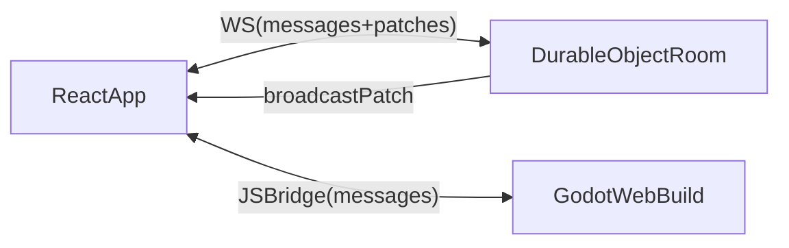

# Acronym Game monorepo plan (Godot + Vite/React + Durable Objects)

## Goals (as stated)
- **Two projects in this repo**:
  - **Godot 4.6.2 app** named `acronym-game-web` for in-game visualization + interactivity (exported to Web).
  - **Static web app** using Vite + React + TanStack + TypeScript + Zod + TinyBase.
- **Shared types + multiplayer**: Godot relies on the web app project for types and multiplayer functionality (TinyBase-based).
- **Branded types/strings**: use branded TS types and *prefixed identifier strings* wherever possible, with a system to map to/from strings.
- **Build sharing**: the Godot Web export must be built/compiled and then shipped/served by the web app (as a separate route).
- **Multiplayer transport**: Cloudflare Durable Objects store, with a “host” role having special permissions/access.

## Key decisions already made
- **Package manager**: npm
- **Edge platform**: Cloudflare Workers + Durable Objects + Cloudflare Pages
- **Godot integration**: served by the React app as a **separate route** (not iframe, not embedded-in-page)

## Proposed repo layout (npm workspaces)
```
acronym-game/
  apps/
    web/                      # Vite + React + TanStack app (static + SPA routing)
    edge/                     # Cloudflare Worker + Durable Objects (multiplayer backend)
  godot/
    acronym-game-web/         # Godot project (Web export output copied into apps/web/)
  packages/
    shared/                   # shared TypeScript-only: branded IDs, schema helpers, protocol types
    protocol/                 # Zod schemas + codecs + versioning (wire formats)
  scripts/                    # build glue (export Godot -> copy into web)
  package.json                # npm workspaces root
```

Notes:
- Godot will not consume TypeScript directly; instead, we standardize **wire formats** (JSON) and **identifier string format** so both sides can interoperate.
- The web app imports from `packages/*`. The edge worker imports from `packages/*`.

## Types + identifiers: branded strings with prefixes
### Identifier string format
Use **typed string IDs** with explicit prefixes:
- `PlayerId` → `"plyr_<base32>"` (or ULID)
- `RoomId` → `"room_<base32>"`
- `GameId` → `"game_<base32>"`

This yields:
- **Human-debuggable** values
- **Runtime type guard** by prefix
- Easy interop with Godot (just strings)

### TypeScript branding approach
In `packages/shared/src/brand.ts`:
- `type Brand<T, B extends string> = T & { readonly __brand: B }`
- `type PlayerId = Brand<string, "PlayerId">` (etc.)

In `packages/shared/src/ids.ts`:
- `parsePlayerId(s: string): PlayerId | null` (prefix check + payload validation)
- `playerIdToString(id: PlayerId): string`
- Similar functions for each ID type

### Zod integration
In `packages/protocol/src/zod.ts`:
- `zPlayerId = z.string().refine(isPlayerIdString).transform(asPlayerId)` (and symmetric serialization helpers)
- Define schemas for all network messages and persistent records.

### Versioning
Put a protocol version constant in `packages/protocol/src/version.ts`, e.g.:
- `export const PROTOCOL_VERSION = 1 as const;`
- All top-level messages include `{ v: PROTOCOL_VERSION }`

## Multiplayer architecture (TinyBase + Durable Objects)
### High-level idea
- Each multiplayer “room” maps to **one Durable Object instance** keyed by `RoomId`.
- Clients connect to the DO over WebSocket.
- The DO maintains:
  - A canonical TinyBase store state (or a minimal authoritative state that can be applied to clients)
  - Client list + roles (`host`, `player`, `spectator`)

### Host role & permissions
Define permissions in protocol:
- Host can:
  - Create/update room configuration (timers, rounds, rules)
  - Start/advance rounds, accept/reject actions, kick players
  - Possibly write to privileged tables/keys (e.g. `room_meta`, `round_state`)
- Non-host can:
  - Submit intents (guesses, votes, etc.) that the DO validates and then applies

Enforcement lives in the DO (never trust the client).

### TinyBase syncing strategy (practical)
Because “TinyBase synchronizer with DO” is custom, we’ll implement a lightweight sync layer:
- Client keeps a TinyBase store.
- Client sends **intents/patches** to DO (validated with Zod).
- DO applies valid changes to authoritative state and broadcasts **patch events**.
- Clients apply patches to their local store.

This preserves TinyBase ergonomics without depending on a specific built-in synchronizer transport.

## Godot Web export integration (separate route)
### How it will be served
The Vite app will serve the Godot export artifacts (e.g. `index.html`, `.wasm`, `.pck`, `.js`) under a dedicated path:
- `/play` route in the React app
- The route loads the Godot export from e.g. `/godot/acronym-game-web/…`

### Build pipeline
- A script exports the Godot project to Web (HTML5/Web) into a staging folder.
- Then copies the export output into the Vite app’s `public/` (or an assets folder that ends up in the final build), for example:
  - `apps/web/public/godot/acronym-game-web/*`

### Communication between React and Godot
Use browser-safe message passing:
- Godot <-> JS bridge via `JavaScriptBridge` (Godot) and `window` APIs (web app)
- Standardize messages using `packages/protocol` schemas
- Use the prefixed ID strings on both sides

## Concrete implementation steps
### 1) Initialize workspace scaffolding
- Create root `package.json` with **npm workspaces** for:
  - `apps/web`
  - `apps/edge`
  - `packages/shared`
  - `packages/protocol`
- Add root `tsconfig.base.json` for shared TS settings.

### 2) Create `packages/shared` (branded IDs + utilities)
- Implement `Brand<>`, ID string format helpers, and safe parsing/formatting.
- Add unit tests for parsing (optional early, but useful).

### 3) Create `packages/protocol` (Zod schemas + codecs)
- Define:
  - `RoomId`, `PlayerId`, etc. schemas
  - WebSocket message schemas (connect/hello, assignRole, intent, patch, error)
  - Room state schemas (minimal canonical shape)
- Export inferred TS types from Zod schemas.

### 4) Create `apps/edge` (Cloudflare Worker + Durable Object)
- Durable Object `RoomDO`:
  - WebSocket upgrade handler
  - Connection lifecycle management
  - Role assignment (host vs non-host)
  - Zod-validated message handling
  - Apply + broadcast patch events
- Worker routes:
  - `POST /api/rooms` → create room, return `RoomId` + join info
  - `GET /api/rooms/:id` (optional) → room metadata
  - `GET /api/rooms/:id/ws` → websocket endpoint

### 5) Create `apps/web` (Vite + React + TanStack)
- Tech:
  - Vite + React + TypeScript
  - TanStack Router (recommended) + TanStack Query (optional)
  - TinyBase for client state; a `RoomClient` wrapper for WS + patching
- Routes:
  - `/` home (create/join room)
  - `/room/:roomId` lobby (host controls + players list)
  - `/play` (Godot export loader route)
- The app consumes `packages/shared` + `packages/protocol`.

### 6) Add Godot project at `godot/acronym-game-web`
- Keep it self-contained as a normal Godot project.
- Define a small “network bridge” layer:
  - Receives events from web app (join room, state updates)
  - Sends intents back (user actions)

### 7) Build glue: export Godot -> web public assets
- Add a script in `scripts/` invoked from root npm scripts, e.g.:
  - `npm run godot:export:web`
  - `npm run web:dev` (optionally watches/copies exports)
  - `npm run build` runs `godot export` then `vite build`

### 8) Deployment plan (Cloudflare)
- `apps/edge` deployed as Worker with Durable Objects bound.
- `apps/web` deployed to Cloudflare Pages.
- Pages can proxy `/api/*` and `/ws/*` to the Worker, or the app can be configured to call the Worker domain directly.

## Data-flow diagram


## Definition of done (first milestone)
- Monorepo boots with `npm install` at root.
- `apps/web` runs locally and can create/join a room.
- `apps/edge` runs locally (Miniflare/wrangler dev) and supports WS connections.
- Shared `RoomId`/`PlayerId` branded strings + Zod schemas are used end-to-end.
- Godot Web export is served at `/play` and can exchange at least one message with the React app.
